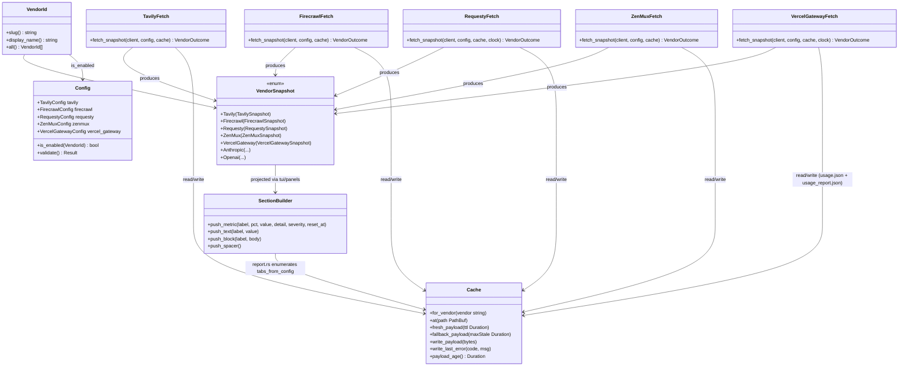
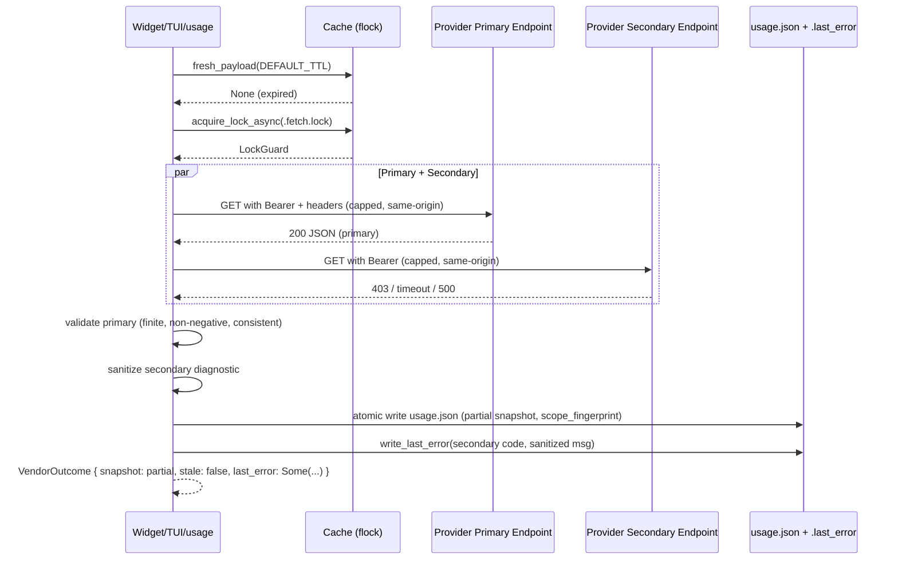
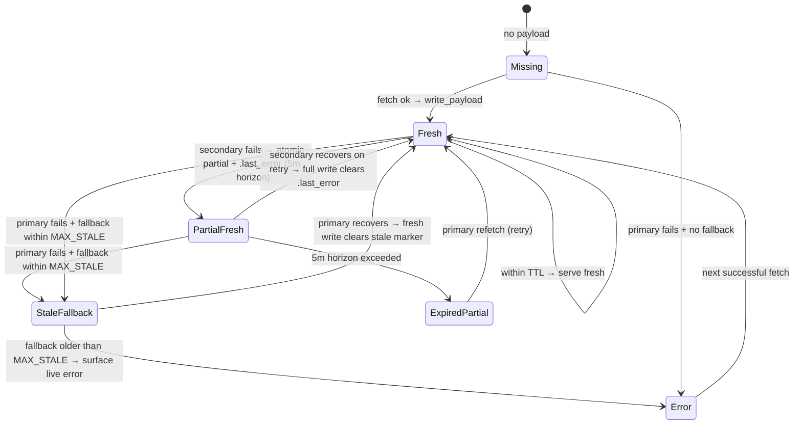
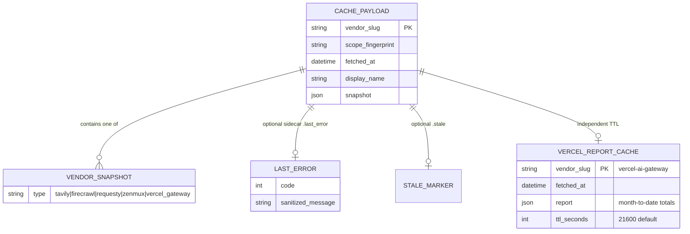
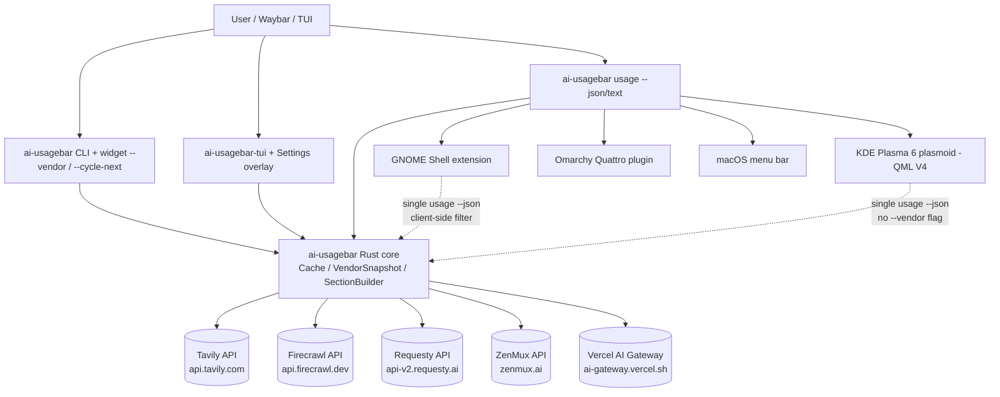

# Introduction

This specification extends `ai-usagebar` with native Rust support for five usage/billing providers — Tavily, Firecrawl, Requesty, ZenMux and Vercel AI Gateway — reusing the existing `Cache`, `VendorSnapshot`, `UsageWindow`, `SectionBuilder`, `MAX_BODY_BYTES` and same-origin redirect primitives while preserving the widget exit-zero fallback, seven-day stale fallback, additive `usage --json` contract and thin-frontend invariants.

# 1. Purpose & Scope

## Purpose

Define the implementation contract for adding five official usage providers as first-class Rust vendors. The contract covers authentication, endpoints, snapshot shapes, cache attribution, failure handling, presentation mapping (Waybar widget, Terminal User Interface (TUI), JavaScript Object Notation (JSON) report, GNOME Shell, KDE Plasma 6, Omarchy Quattro, macOS menu bar) and documentation, in vertical slices that remain independently removable.

## Scope

- **In scope:** Five `VendorId` variants, five config sections (`tavily`, `firecrawl`, `requesty`, `zenmux`, `vercel-ai-gateway`), five `src/<vendor>/{mod,types,fetch,vendor}.rs` modules, five `VendorSnapshot` variants, placeholder families, TUI/widget/JSON/GNOME/KDE/Omarchy/macOS parity, hermetic tests, ignored live smoke tests, docs.
- **Out of scope:** Generic vendor adapter framework, refactor of existing vendors, multi-account per new provider, Windows 11 notification-area frontend, import of external databases/daemons/JavaScript runtimes/Go binaries or third-party Command-Line Interface (CLI) output contracts.
- **Audience:** Rust contributors, frontend adapter maintainers, reviewers of `src/config.rs`, `src/vendor.rs`, `src/usage.rs`, `src/report.rs`, `src/cache.rs`.

## Assumptions

- Official provider documentation is the source of truth; response shapes are rechecked per slice.
- One account or project per new provider in this release.
- The existing `ai-usagebar usage --json` shape is additive only; no field is removed or reordered after release.

# 2. Definitions

| Term | Definition |
|------|------------|
| **VendorId** | Stable enum variant in `src/vendor.rs` used by `--vendor` and `config.toml`. `slug()` is the wire name, `display_name()` the canonical label. |
| **VendorSnapshot** | Discriminated union in `src/usage.rs`; each vendor keeps its exact wire fields instead of a flattened shape. |
| **UsageWindow** | Generic `utilization_pct` (0..=100) + `resets_at` + `window_duration`; used when a provider reports a quota window. |
| **SectionBuilder** | Builder in `src/tui/panels.rs` that projects a snapshot into ordered `Section::{Title,Metric,Text,Block,Spacer}` rows; `push_metric` attaches absolute `reset_at`. |
| **Cache** | Per-vendor directory `~/.cache/ai-usagebar/<vendor>/` with `usage.json`, `.stale`, `.last_error`, `.fetch.lock`, flock + `tempfile + persist` atomic writes. |
| **Scope fingerprint** | Non-secret hex digest stored in the cached payload that binds the payload to an API key + optional project/target context. |
| **PAYG (Pay-As-You-Go)** | Post-paid credit purchased separately from subscription quota; relevant to Tavily and ZenMux. |
| **TTL (Time To Live)** | Freshness window for a cached payload (`DEFAULT_TTL` 60 s for most vendors; 6 h for Vercel report). |
| **MAX_BODY_BYTES** | 2 MiB cap enforced by `vendor::read_body_capped` before buffering. |
| **MAX_STALE** | 7-day fallback window (`cache::MAX_STALE`); beyond it the failure path returns no stale payload. |
| **TUI** | Terminal User Interface (`ai-usagebar-tui`, ratatui). |
| **QML (Qt Modeling Language)** | Language for the KDE Plasma 6 plasmoid; engine is V4, so optional catch bindings and `\p{...}` are forbidden. |
| **OIDC (OpenID Connect)** | Token type optionally accepted by Vercel AI Gateway via configurable env var. |

# 3. Requirements (EARS Format)

## 3.1 Ubiquitous Requirements

- **REQ-001**: The system shall add five `VendorId` variants with stable slugs `tavily`, `firecrawl`, `requesty`, `zenmux`, `vercel-ai-gateway`, short codes `tav`, `fcw`, `rqy`, `zmx`, `vag`, and display names `Tavily`, `Firecrawl`, `Requesty`, `ZenMux`, `Vercel AI Gateway`, and include them in `VendorId::all()` canonical order per implementation order.
- **REQ-002**: The system shall expose each vendor as opt-in disabled by default (`enabled = false`) and shall not fetch when disabled, preserving existing installs.
- **REQ-003**: The system shall define one `VendorSnapshot` variant per provider that retains exact vendor fields without flattening into a universal shape.
- **REQ-004**: The system shall reuse existing Rust primitives for every slice: `Cache` atomic writes and `acquire_lock_async`, `read_body_capped` with `MAX_BODY_BYTES`, `same_origin_redirect_policy`, `finite_amount`/`parse_amount`, `VendorSnapshot`, `UsageWindow`, `SectionBuilder::push_metric`, `VENDOR_SECRET_ENV_VARS` filtering and `vendor_secret_env_vars_to_remove`.
- **REQ-005**: The system shall store a non-secret `scope_fingerprint` in each cached payload derived from a SHA-256 digest of the resolved API key plus normalized optional context (Tavily `project_id`, Vercel OIDC env-var identity), following the existing `opencode_go` fingerprint convention, and shall compare fingerprints with plain equality.
- **REQ-006**: The system shall validate every wire monetary and quota field as required, finite, and non-negative where semantically impossible to be negative, and shall reject malformed, duplicate, unsupported-currency or inconsistent values as `AppError::Schema`.
- **REQ-007**: The system shall use provider billing cycles for `reset_at` when returned; for calendar month-to-date range queries the system shall use Coordinated Universal Time (UTC) month start `YYYY-MM-01T00:00:00Z` to now.
- **REQ-008**: The system shall preserve the widget exit-zero fallback (`widget::run::fallback` emits valid `⚠` JSON and exits `0`), atomic writes, seven-day stale fallback, capped bodies, same-origin redirects and `401`/`403` body redaction (`AUTH_FAILURE_MESSAGE`).
- **REQ-009**: The system shall never invent percentages for balance-only providers; rows without a denominator shall be `Section::Text`/`Block`, not `Section::Metric` with a fabricated `0%`.
- **REQ-010**: The system shall keep frontends thin: `VendorId::display_name()` remains the sole canonical provider-name table; no frontend shall maintain a parallel full name table, and `src/report.rs` shall not recreate a per-vendor metric-order table.
- **REQ-011**: The system shall keep `ai-usagebar usage --json` additive: ordered `sections`, real non-percentage rows, `severity`, absolute `reset_at`, `stale`, `fetched_at`, `primary` are preserved and no stable field is removed after release.
- **REQ-012**: The system shall protect inline keys in `config.toml` via `has_inline_api_keys` / `protect_inline_api_keys` (mode `0600` on Unix) and shall extend that set to include all five new `api_key` fields plus any per-account keys.

## 3.2 Event-Driven Requirements

- **REQ-013**: WHEN the widget, TUI refresh, or `usage` report requests a vendor snapshot, the system shall serve a fresh cached payload if its age is below `DEFAULT_TTL` without issuing a network request.
- **REQ-014**: WHEN the cache is expired or missing, the system shall acquire the vendor lock, fetch the primary endpoint with `Authorization: Bearer <key>` (and `X-Project-ID` for Tavily when configured), apply the capped read and same-origin redirect policy, validate the payload and atomically write `usage.json` clearing `.stale` and `.last_error`.
- **REQ-015**: WHEN a provider requires a secondary detailed endpoint (Firecrawl historical, Requesty usage, ZenMux subscription, Vercel report), the system shall fetch primary and secondary concurrently with `tokio::join` where cache state allows.
- **REQ-016**: WHEN the secondary detailed fetch fails while the primary succeeds, the system shall cache the partial snapshot atomically, persist one sanitized secondary diagnostic to `.last_error` via `Cache::write_last_error`, keep `stale = false` and use a five-minute retry horizon for the partial payload instead of `DEFAULT_TTL`.
- **REQ-017**: WHEN a scope fingerprint mismatch is detected (changed key or Tavily `project_id`), the system shall force a refetch and shall never reuse the previous scope's fresh or stale payload.
- **REQ-018**: WHEN a user invokes `--cycle-next` / `--cycle-prev`, the system shall cycle `~/.cache/ai-usagebar/active_vendor` through enabled vendors in canonical order with wrapping, using the same atomic write primitive.
- **REQ-019**: WHEN `ai-usagebar-tui` settings are saved, the system shall persist via `toml_edit` preserving comments/whitespace, `chmod 600` the file on Unix and signal Waybar with `SIGRTMIN+13` where configured.

## 3.3 State-Driven Requirements

- **REQ-020**: WHILE a cached payload is fresh (`age < DEFAULT_TTL` or `age < report_cache_ttl_seconds` for Vercel report), the system shall not issue a network request for that payload.
- **REQ-021**: WHILE a snapshot is in partial state (primary live, secondary absent), the system shall report the warning as a sanitized `Section::Text` or sidecar diagnostic and shall continue to serve the primary block on subsequent ticks without fabricating missing fields.
- **REQ-022**: WHILE the system is in failure state with a payload younger than `MAX_STALE`, the system shall serve the fallback payload as stale (`stale = true`) alongside the sanitized `.last_error`; beyond `MAX_STALE` it shall surface the live error with no stale payload.
- **REQ-023**: WHILE Vercel reporting is disabled (`report_enabled = false`), the system shall never call `/v1/report` regardless of cache age.

## 3.4 Unwanted Behavior Requirements

- **REQ-024**: IF a wire response is malformed, truncated beyond `MAX_BODY_BYTES`, contains non-finite or negative-where-impossible values, duplicate keys where unique, or an unsupported currency, THEN the system shall reject the payload as `AppError::Schema`, clear no valid fallback younger than `MAX_STALE`, and expose a user-facing sanitized error.
- **REQ-025**: IF an HTTP response is `401` or `403`, THEN the system shall redact the persisted `.last_error` body to `AUTH_FAILURE_MESSAGE` and shall not persist credential-bearing material; the display layer shall sanitize via `display::sanitize_untrusted_field`.
- **REQ-026**: IF a response body exceeds `MAX_BODY_BYTES` (either via `Content-Length` or chunked accumulation), THEN the system shall refuse to buffer it and shall surface a schema error without caching the partial body.
- **REQ-027**: IF a redirect targets a different scheme/host/port, THEN the system shall not follow it and shall not forward `Authorization` or `x-api-key` headers.
- **REQ-028**: IF a provider returns an unsupported plan or `403` for a secondary report endpoint (Vercel report on an ineligible plan; Tavily without report fields), THEN the system shall retain primary credit data, leave detail absent and surface a sanitized warning without retrying in a tight loop.
- **REQ-029**: IF checked integer addition overflows or a monetary sum is non-finite while aggregating daily report rows (Requesty, Vercel), THEN the system shall treat the aggregation as a schema error rather than wrapping or producing `NaN`.
- **REQ-030**: IF a historical row cannot be matched to the current billing period (Firecrawl) or an unknown `account_status` is returned (ZenMux), THEN the system shall leave the detail absent (Firecrawl) or map to `Other(String)` with degraded severity (ZenMux) rather than selecting an arbitrary row or treating it as healthy.
- **REQ-031**: IF the wire omits a reset timestamp, THEN the system shall set `resets_at = None` and shall produce no fabricated `reset_at` or pacing data.

## 3.5 Optional Requirements

- **REQ-032**: WHERE `tavily.project_id` is configured as a non-empty string, the system shall send `X-Project-ID: <id>` and shall include the normalized `project_id` in the scope fingerprint and cache attribution.
- **REQ-033**: WHERE `vercel-ai-gateway.report_enabled = true`, the system shall fetch `/v1/report` only when its independent cache (`usage_report.json`) is expired per `report_cache_ttl_seconds`.
- **REQ-034**: WHERE `vercel-ai-gateway.api_key_env` is overridden from the default `AI_GATEWAY_API_KEY`, the system shall resolve the key from that env var and shall include the env-var name in the scope fingerprint so an OIDC token rotation is not served from the previous token's cache.
- **REQ-035**: WHERE a provider returns optional breakdown fields (Tavily endpoint counts, Firecrawl `planCredits`/`remainingCredits`, ZenMux bonus), the system shall display them as ordered `Section::Text`/`Block` rows after the headline metric.

## 3.6 Complex Requirements

- **REQ-036**: WHEN the Vercel credits fetch succeeds WHERE reporting is enabled and the report cache is expired, the system shall query `/v1/report` with inclusive UTC calendar-date `start_date`/`end_date` bounds and `group_by=day`; IF that report fetch fails with `403`, THEN the system shall still cache and display the credits payload with a sanitized warning and a six-hour report retry horizon.
- **REQ-037**: WHEN ZenMux is queried WHERE both PAYG and subscription endpoints are reachable, the system shall require at least one valid block (`PAYG.is_some() || subscription.is_some()`); IF both fail, THEN the system shall surface a schema/HTTP error with no stale promotion beyond `MAX_STALE`.
- **REQ-038**: WHEN Firecrawl is queried WHERE the historical endpoint returns multiple period rows, the system shall select only the unique row whose interval contains the current `billingPeriodStart` (an exact start-date match is preferred); IF none or multiple rows match, THEN the system shall leave period-consumed absent and shall not synthesize it from another period.

## 3.7 Non-Functional Requirements

- **NFR-001 — Security**: Inline keys are `chmod 600` on Unix; env keys are read via `resolve_api_key` (env wins over inline); secrets never appear in logs, JSON output, or `.last_error` for `401`/`403`; no secret is used as a KML key; Windows resolves home via `directories::BaseDirs` (`%USERPROFILE%` / Known Folder).
- **NFR-002 — Performance**: Fresh-cache path performs only `metadata().modified()` + file read; network path uses `HTTP_CLIENT_TIMEOUT` 30 s outer, per-request tighter timeouts, and `MAX_BODY_BYTES` pre-check; Vercel report does not block credits refresh.
- **NFR-003 — Scalability**: Sequential `usage` enumeration avoids firing all vendors/accounts concurrently against the same cache lock; per-vendor `.fetch.lock` serializes multi-monitor Waybar instances.
- **NFR-004 — Reliability**: Atomic `tempfile + persist` plus `fsync` on every payload and sidecar write; `MAX_STALE` bounds staleness; partial snapshots retain a short 5-minute horizon to avoid hiding secondary outages.
- **NFR-005 — Portability**: `config.toml` path via `directories::ProjectDirs` on Linux/macOS/Windows; Waybar widget remains Wayland-only while `usage`, `usage --json` and TUI run on Windows via `%USERPROFILE%\.claude\.credentials.json` / `%USERPROFILE%\.codex\auth.json` conventions; no hard-coded `~/.config`.
- **NFR-006 — Compatibility**: `usage --json` additive; new vendors append entries in `VendorId::all()` order; existing placeholders remain; new short codes do not collide with the existing codes (`cld,gpt,zai,opr,dsk,kmi,klo,nvt,msh,grk,sgk,aac,agy,cur,mmx,kir` plus `nrs` for Nous and `ocg` for OpenCode Go, defined in their `src/*/vendor.rs` modules).
- **NFR-007 — Testability**: All I/O behind injectable seams (`Cache::at`, `fetch_at` with `Endpoints` override, clock injection for month-to-date bounds, `candidate_bases_with`); hermetic tests never touch real `$HOME`/`$XDG`/credential paths; live tests are `#[ignore]` and credential-gated.
- **NFR-008 — Observability**: Sanitized warnings visible in TUI panel, `usage` text report, tooltip and JSON `sections`; `.last_error` holds `(code, sanitized_message)` for post-mortem without credential leakage.
- **NFR-009 — Accessibility**: Keyboard navigation must remain complete without a mouse (Up/Down + wrap navigate the vendor menu; Settings remains fully keyboard-operable). Mouse is an addition, never a requirement. Contrast and focus indicators are preserved.
- **NFR-010 — Active-scope compatibility**: Absent `ui.active_vendors` preserves legacy enabled-and-configured automatic fetch behavior. Once Settings writes an explicit list, automatic TUI, report, and widget-cycle fetches are limited to that list; explicit `--vendor` remains available for diagnostics.

## 3.8 User Interface Requirements (TUI navigation, mouse, provider visibility)

Requested 2026-08-23. Targets the ratatui TUI only: GNOME/KDE/Omarchy and the
macOS menu bar are already mouse-driven and consume `usage --json`, so they
need no change. Current gaps verified in code: `handle_key` in
`src/bin/ai-usagebar-tui.rs` maps only `Tab`/`l`/`→` and `BackTab`/`h`/`←` to
tab cycling (no Up/Down); `EnableMouseCapture` is active but the event loop
matches only `Event::Key` and drops `Event::Mouse`; the Settings overlay lists
every API-key vendor unconditionally.

- **REQ-039**: The system shall navigate the vendor menu (the selectable ring `[Overview, tab0, tab1, …]`) with the Up and Down arrow keys with wrap-around, keeping `Tab`/`Shift+Tab`/`l`/`h`/`Left`/`Right` as secondary aliases.
- **REQ-040**: The system shall process mouse events in the TUI event loop: a click on a vendor menu entry shall select that provider, a click on a Settings overlay field shall move focus to it, and clicks outside interactive areas shall be ignored.
- **REQ-041**: The system shall list in the vendor menu and the Overview only providers in the automatic active scope: enabled, credential-resolvable providers filtered by `ui.active_vendors` when that list is configured. A provider enabled without a resolvable credential shall not appear as a selectable entry.
- **REQ-042**: The system shall keep the Settings overlay as the configuration surface for every API-key provider, but shall group or collapse providers that are neither configured nor enabled (e.g., a "Configured" section plus a collapsed "More providers" section) so unconfigured entries do not dominate the screen.
- **REQ-043**: The system shall preserve the existing behavior of showing selected-and-failing providers with their error state in the vendor menu; only providers outside the active scope or without a credential source are hidden.
- **REQ-044**: The system shall update the TUI key-hints footer and `README.md` TUI controls to reflect Up/Down and mouse navigation without breaking existing shortcuts.
- **REQ-045**: The system shall support optional `[ui] active_vendors = ["<vendor-id>", …]` as the explicit automatic fetch/display scope for TUI tabs, Overview, `usage --json`, widget cycling, and implicit widget vendor resolution. When the field is absent, the system shall preserve legacy enabled-and-configured behavior; an empty list shall disable automatic fetches while retaining explicit `--vendor` one-off checks.
- **REQ-046**: The Settings overlay shall render configured active-provider candidates as keyboard- and mouse-operable checkboxes. Toggling a checkbox shall update the selected scope; entering and saving a non-empty API key shall add that provider to the active scope, and clearing a key shall remove it.
- **REQ-047**: The system shall allow explicit `--vendor <id>` to bypass `ui.active_vendors`, while still requiring the provider's normal credential resolution, so one-off diagnostics do not expand background fetch scope.

# 4. Constraints & Guidelines

- **CON-001**: No generic vendor adapter framework — keep one module and one `VendorSnapshot` variant per provider.
- **CON-002**: Do not refactor existing providers as part of this change; each vertical slice is independently removable.
- **CON-003**: Official provider docs override third-party blog summaries; recheck auth headers and query params before each slice.
- **CON-004**: Respect global rate limits; use `interval: 300` for widget polling and 60 s file cache so multi-monitor setups coexist via flock — do not lower intervals to hide API drift.
- **CON-005**: Preserve `section` ordering via `SectionBuilder`; do not recreate a per-vendor metric-order table in `report.rs`.
- **CON-006**: Keep the seven-day `MAX_STALE`, `DEFAULT_TTL` 60 s, and 10-redirect same-origin limit unchanged unless this spec explicitly overrides for a sub-cache (Vercel report 6 h).
- **GUD-001**: Implement in order Tavily (done) → **TUI Navigation & Provider Visibility (§3.8, user request 2026-08-23 — takes priority over Firecrawl)** → Firecrawl → Requesty → ZenMux → Vercel AI Gateway; complete desktop adapter mappings/tests before starting the next slice.
- **GUD-002**: Add `VENDOR_SECRET_ENV_VARS` entries and `vendor_secret_env_vars_to_remove` coverage together with each `VendorId`.
- **GUD-003**: Extend `has_inline_api_keys` / `protect_inline_api_keys` for every new `api_key` field, including any per-account keys if added.
- **GUD-004**: Use `SectionBuilder::push_metric` for every gauge so absolute `reset_at` travels with the metric into `usage --json`.
- **GUD-005**: For `422` rate-limit on ZenMux, surface the retryable diagnostic without treating it as auth failure.
- **PAT-001**: Single-endpoint flow — `fresh_payload` → `acquire_lock_async` → `fetch` → `read_body_capped` → `parse` → `write_payload`.
- **PAT-002**: Dual-endpoint flow — `tokio::join(primary, secondary)` → validate independently → partial-cache on secondary failure.
- **PAT-003**: Balance-only vendors expose only `Cents`/`f64` balances as `Text`; quota vendors expose `UsageWindow` gauges as `Metric`.

# 5. Visual Models & Diagrams

## 5.1 Component / Class Diagram — Vendor Module Topology



## 5.2 Sequence Diagram — Fresh Fetch with Partial Secondary



## 5.3 State Diagram — Cache & Snapshot Lifecycle



## 5.4 Entity Relationship Diagram — Cached Payload Shape



## 5.5 Data Flow Diagram — Report Aggregation

```mermaid
flowchart LR
    A[Config::load / tabs_from_config] --> B[tui::app::refresh_one per TabId]
    B --> C{Cache fresh?}
    C -- Yes --> D[Deserialize Cached VendorSnapshot]
    C -- No --> E[Fetch primary (+secondary)]
    E --> F[Validate finite / non-negative / consistent]
    F --> G[Atomic write usage.json + .last_error if partial]
    G --> D
    D --> H[tui::panels::sections_for -> SectionBuilder]
    H --> I[report::sections ordered]
    I --> J[usage --json entries: id, display_name, plan, metrics, sections, severity, reset_at, stale, fetched_at]
    I --> K[usage text report + tooltip]
    J --> L[GNOME/KDE/Omarchy/macOS adapters client-side filter]
```

## 5.6 Business Process — Vertical Slice Gate

```mermaid
flowchart TD
    S([Start slice N]) --> R[Recheck official API docs + auth header]
    R --> T[Implement src/<vendor>/{types,fetch,vendor}.rs + Config + VendorId + VendorSnapshot]
    T --> C[Add inline-key protection + KEY_VENDORS entry]
    C --> W[Wire placeholders + SectionBuilder projection + TUI panels]
    W --> H[Hermetic tests: mock, cache round-trip, partial, fingerprint]
    H --> L[Ignored live smoke test credential-gated]
    L --> D[Docs: vendor-endpoints, format-placeholders, configuration, config.example.toml, README]
    D --> F[Desktop adapters: GNOME marker + macOS mapping + KDE QML V4 + Omarchy model.test.mjs]
    F --> V[make test + make desktop-test + cargo fmt/clippy/machete + qml-lint/test if Qt6]
    V -->|Pass| N{Next slice?}
    V -->|Fail| R
    N -->|Yes| S
    N -->|No| E([All 5 done → cross-provider verification + changelog])
```

## 5.7 System Context Diagram



## 5.8 Decision Table — Snapshot Usability & Severity

| Primary | Secondary | ZenMux Both | Action | Warning | Severity source |
|---------|-----------|-------------|--------|---------|-----------------|
| ok | ok | — | cache full snapshot, stale=false | — | worst window or balance |
| ok | fail | — | cache partial + `.last_error` sanitized, stale=false | secondary diagnostic | primary block only |
| fail | ok | — | fallback if within MAX_STALE else error | primary error | stale / error |
| — | — | PAYG ok | cache snapshot (PAYG only) | subscription absent | PAYG balance |
| — | — | sub ok | cache snapshot (sub only) | PAYG absent | worst sub window |
| — | — | both fail | no cache, surface error | combined error | error |
| fail | fail | — | fallback else error | primary+secondary | stale / error |

# 6. Interfaces & Data Contracts

## 6.1 Configuration Interface (`~/.config/ai-usagebar/config.toml`)

```toml
[tavily]
enabled = false
api_key_env = "TAVILY_API_KEY"
# api_key = "..."                 # fallback; chmod 600
# project_id = "..."              # optional; sent as X-Project-ID, part of fingerprint

[firecrawl]
enabled = false
api_key_env = "FIRECRAWL_API_KEY"
# api_key = "..."

[requesty]
enabled = false
api_key_env = "REQUESTY_API_KEY"
# api_key = "..."

[zenmux]
enabled = false
api_key_env = "ZENMUX_MANAGEMENT_API_KEY"
# api_key = "..."                 # must be management key; standard keys rejected

[vercel-ai-gateway]
enabled = false
api_key_env = "AI_GATEWAY_API_KEY"
# api_key = "..."                 # or OIDC token via custom env
report_enabled = false
report_cache_ttl_seconds = 21600  # valid 300..86400 inclusive
```

Validation rules:

- `api_key_env` must be a valid env-var name (`^[A-Za-z_][A-Za-z0-9_]*$`) else credential error.
- `report_cache_ttl_seconds` ∈ [300, 86400]; zero/negative/non-finite rejected.
- Inline keys extend `has_inline_api_keys` / `protect_inline_api_keys` (`chmod 600`).

## 6.2 HTTP Contracts

Response field names for slices not yet implemented remain illustrative pending
per-slice verification against official docs (CON-003, GUD-001). Firecrawl and
Requesty field names below were verified against their published API references;
the linked official reference remains authoritative if it changes.

| Provider | Method & URL | Auth | Success | Error handling |
|----------|--------------|------|---------|----------------|
| Tavily | `GET https://api.tavily.com/usage` | `Authorization: Bearer <TAVILY_API_KEY>` + optional `X-Project-ID` | 200 JSON: `plan`, `limits`, `payAsYouGo`, `apiKeyUsage`, endpoint breakdown | 401/403 redacted; missing fields → Schema; non-finite → Schema |
| Firecrawl | `GET https://api.firecrawl.dev/v2/team/credit-usage` | `Authorization: Bearer <FIRECRAWL_API_KEY>` | 200 JSON: `success`, `data:{remainingCredits,planCredits,billingPeriodStart,billingPeriodEnd}` | current data remains primary; 401/403 redacted |
| Firecrawl | `GET https://api.firecrawl.dev/v2/team/credit-usage/historical?byApiKey=false` | same | 200 JSON: `success`, `periods:[{startDate,endDate,apiKey,totalCredits}]` | failure → partial current snapshot; unmatched period → absent detail |
| Requesty | `GET https://api-v2.requesty.ai/v1/manage/org` | `Authorization: Bearer <REQUESTY_API_KEY>` | 200 JSON: `{name,balance}` | 401/403 redacted |
| Requesty | `GET https://api-v2.requesty.ai/v1/manage/org/usage?start=...&end=...&resolution=day` | same | 200 JSON: `usage:{period:{spend,total_requests,input_tokens,output_tokens,total_tokens}}` | omit optional `group_by`; failure → partial primary snapshot |
| ZenMux | `GET https://zenmux.ai/api/v1/management/payg/balance` | `Authorization: Bearer <ZENMUX_MANAGEMENT_API_KEY>` | 200 JSON: `success,data:{currency,total_credits,top_up_credits,bonus_credits}` | either block alone suffices; standard keys return management-key diagnostics |
| ZenMux | `GET https://zenmux.ai/api/v1/management/subscription/detail` | same | 200 JSON: `success,data:{plan,account_status,quota_5_hour,quota_7_day,quota_monthly}` | `usage_percentage` is a 0.0..1.0 fraction; `422` is rate limiting |
| Vercel | `GET https://ai-gateway.vercel.sh/v1/credits` | `Authorization: Bearer <AI_GATEWAY_API_KEY or OIDC>` | 200 JSON: `balance, total_used` USD | always required |
| Vercel | `GET https://ai-gateway.vercel.sh/v1/report?start_date=YYYY-MM-DD&end_date=YYYY-MM-DD&group_by=day` | same | 200 JSON: `results:[{day,total_cost,input_tokens,output_tokens,request_count}]` | 403 → credits retained |

Common transport: `reqwest` with `HTTP_CLIENT_TIMEOUT` 30 s outer, per-request tighter, `read_body_capped` 2 MiB, `same_origin_redirect_policy` (10 hops max, scheme/host/port must match).

Firecrawl compatibility note: the published schema names the historical count
`totalCredits`, while the live response may return `creditsUsed`; both map to
`period_consumed`. The current in-progress period may also return
`endDate: null`, which is valid and does not invalidate the current-credit
snapshot.

## 6.3 Snapshot Shapes (`src/usage.rs`)

```rust
// All derive Debug, Clone, PartialEq (+ Eq where f64 absent or wrapper)
// Money validated via finite_amount; integers via checked arithmetic.

pub struct TavilySnapshot {
    pub plan: String,
    pub plan_used: u64, pub plan_limit: Option<u64>,
    pub payg_used: f64, pub payg_limit: Option<f64>,
    pub key_used: u64, pub key_limit: Option<u64>,
    pub search: u64, pub extract: u64, pub crawl: u64, pub map: u64, pub research: u64,
    pub currency: Option<String>,
    pub scope_fingerprint: String,
}

pub struct FirecrawlSnapshot {
    pub remaining_credits: u64,
    pub plan_credits: u64,
    pub billing_period_start: Option<DateTime<Utc>>,
    pub billing_period_end: Option<DateTime<Utc>>,
    pub period_consumed: Option<u64>, // matched historical row
    pub scope_fingerprint: String,
}

pub struct RequestySnapshot {
    pub org_name: String,
    pub balance: f64,
    pub usage: Option<RequestyUsage>,
    pub interval_start: DateTime<Utc>,
    pub interval_end: DateTime<Utc>,
    pub scope_fingerprint: String,
}

pub struct RequestyUsage {
    pub mtd_spend: f64,
    pub requests: u64,
    pub input_tokens: u64,
    pub output_tokens: u64,
    pub total_tokens: u64,
}

pub enum ZenMuxStatus { Healthy, Monitored, Abusive, Suspended, Banned, Other(String) }
pub struct ZenMuxPayg { pub total_credits: f64, pub top_up_credits: f64, pub bonus_credits: f64 }
pub struct ZenMuxQuota {
    pub window: UsageWindow,
    pub max_flows: f64, pub used_flows: f64, pub remaining_flows: f64,
    pub used_value_usd: f64, pub max_value_usd: f64,
}
pub struct ZenMuxSubscription {
    pub tier: String, pub plan_amount_usd: f64, pub expires_at: DateTime<Utc>,
    pub status: ZenMuxStatus, pub base_usd_per_flow: f64, pub effective_usd_per_flow: f64,
    pub five_hour: ZenMuxQuota, pub seven_day: ZenMuxQuota,
    pub monthly_max_flows: f64, pub monthly_max_value_usd: f64,
}
pub struct ZenMuxSnapshot {
    pub payg: Option<ZenMuxPayg>,
    pub subscription: Option<ZenMuxSubscription>,
    pub scope_fingerprint: String,
}

pub struct VercelGatewaySnapshot {
    pub balance: f64,
    pub total_used: f64, // lifetime
    pub report: Option<VercelReport>, // independent cache
    pub scope_fingerprint: String,
}
pub struct VercelReport {
    pub mtd_cost: f64, pub input_tokens: u64, pub output_tokens: u64, pub requests: u64,
    pub interval: (DateTime<Utc>, DateTime<Utc>),
}
```

## 6.4 Placeholder Contract (`--format` / `--tooltip-format`)

| Provider | `vendor_short` | Generic aliases | Provider-specific |
|----------|---------------|----------------|-------------------|
| Tavily | `tav` | `{plan}`, `{session_pct}` when plan % exists | `{tav_plan}`, `{tav_plan_pct}`, `{tav_plan_used}`, `{tav_plan_limit}`, `{tav_payg_used}`, `{tav_key_used}`, `{tav_search}`, `{tav_extract}`, `{tav_crawl}`, `{tav_map}`, `{tav_research}` |
| Firecrawl | `fcw` | `{session_pct}`, `{weekly_pct}` map to period % when available | `{fcw_remaining}`, `{fcw_plan}`, `{fcw_used}`, `{fcw_pct}`, `{fcw_reset}` |
| Requesty | `rqy` | `{plan}` aliases org name | `{rqy_org}`, `{rqy_balance}`, `{rqy_mtd}`, `{rqy_requests}`, `{rqy_tokens}`, `{rqy_input}`, `{rqy_output}` |
| ZenMux | `zmx` | `{session_pct}`, `{weekly_pct}` subscription windows when available | `{zmx_headline}`, `{zmx_payg}`, `{zmx_topup}`, `{zmx_bonus}`, `{zmx_tier}`, `{zmx_status}`, `{zmx_five}`, `{zmx_seven}`, `{zmx_expiry}` |
| Vercel AI Gateway | `vag` | `{session_pct}` not used (balance-only unless report) | `{vag_balance}`, `{vag_used}`, `{vag_mtd}`, `{vag_requests}`, `{vag_input}`, `{vag_output}` |

Balance-only placeholders render as `Text` (`$D.CC`) or `Block`; no fake `Metric`.

## 6.5 Report Contract (`usage --json`)

```json
{
  "primary": "anthropic",
  "entries": [
    {
      "id": "tavily",
      "name": "tavily",
      "display_name": "Tavily",
      "plan": "Pro",
      "status": "ready",
      "error": null,
      "stale": false,
      "fetched_at": "2026-08-23T00:00:00Z",
      "metrics": [{ "label": "Plan", "percent": 62, "value": "62%", "detail": "Resets in 12d", "severity": "mid", "reset_at": "2026-09-01T00:00:00Z" }],
      "sections": [
        { "type": "metric", "label": "Plan", "percent": 62, "value": "62%", "detail": "62 of 100", "severity": "mid", "reset_at": "2026-09-01T00:00:00Z" },
        { "type": "text", "label": "Balance", "value": "$12.50" },
        { "type": "block", "label": "Usage by endpoint", "body": ["search 42 · extract 10"] },
        { "type": "spacer" }
      ]
    }
  ]
}
```

Ordering is the configured `ui.active_vendors` scope (or legacy enabled-and-configured fallback) plus real `fetched_at`/`reset_at` RFC 3339; `metrics` is the `Metric`-only projection of `sections`.

# 7. Acceptance Criteria

- **AC-001**: Given a config with `tavily.enabled = true` and `TAVILY_API_KEY` set, When the widget requests Tavily, Then the system sends `Authorization: Bearer <key>` to `GET https://api.tavily.com/usage` and renders plan/payg/key usage without inventing reset timestamps.
- **AC-002**: Given `tavily.project_id = "prj_123"`, When fetching, Then the request includes `X-Project-ID: prj_123` and the cache payload fingerprint includes the normalized project id, so changing it forces a refetch and never reuses the prior project's payload.
- **AC-003**: Given Tavily `plan.limit` missing or zero, When rendering headline, Then the system shows a truthful text headline with no percentage and no gauge.
- **AC-004**: Given Firecrawl with `data.remainingCredits` and `data.planCredits` plus a unique historical row whose interval contains `data.billingPeriodStart`, When rendering, Then headline is `used / planCredits` percentage preserving >100 in label and clamping only the gauge, and `reset_at` equals `data.billingPeriodEnd`.
- **AC-005**: Given Firecrawl historical rows with no unique interval containing `data.billingPeriodStart`, When rendering, Then `period_consumed` is absent and no arbitrary row is chosen; remaining credits still display.
- **AC-006**: Given Firecrawl historical fetch returns 500, When primary succeeds, Then the system caches remaining+plan credits with `stale=false`, writes sanitized `.last_error` and shows primary data with warning.
- **AC-007**: Given Requesty with 10 daily usage rows for August, When aggregating, Then totals equal checked sum of all rows and interval is `2026-08-01T00:00:00Z` to `now`; a fixed injected clock yields deterministic bounds in tests.
- **AC-008**: Given Requesty `GET /v1/manage/org` succeeds but `/v1/manage/org/usage` returns 403, When rendering, Then balance and org name display with a sanitized warning and token/cost totals are absent rather than zero.
- **AC-009**: Given ZenMux with valid PAYG and subscription, When fetching concurrently, Then snapshot contains both blocks and severity is the worst of five-hour/seven-day windows.
- **AC-010**: Given ZenMux PAYG valid but subscription returns 401 with standard key, When rendering, Then the system shows PAYG balance with a "management key required" diagnostic and does not treat the account as healthy.
- **AC-011**: Given ZenMux `usage_percentage = 0.84` and `account_status = "grace_period_unknown"`, When parsing, Then pct converts to `84` via round and status maps to `Other("grace_period_unknown")` with degraded severity.
- **AC-012**: Given Vercel with `report_enabled = false`, When the report cache is expired, Then the system never calls `/v1/report` and credits still refresh on the 60 s TTL.
- **AC-013**: Given Vercel with `report_enabled = true` and `report_cache_ttl_seconds = 21600`, When `/v1/credits` succeeds and `/v1/report` returns 403 unsupported plan, Then credits display as balance with a sanitized warning and report totals remain absent without blocking credits.
- **AC-014**: Given Vercel report returns daily rows for August, When aggregating, Then `mtd_cost` and token/request totals equal finite/checked sums and lifetime `total_used` is not confused with month-to-date cost.
- **AC-015**: Given any provider returns a wire value that is NaN, infinite or negative where impossible, When parsing, Then the system returns `AppError::Schema` and does not cache the payload; the widget still exits `0` with fallback JSON.
- **AC-016**: Given an HTTP 401/403 body containing credential material, When persisting `.last_error`, Then the persisted message equals `AUTH_FAILURE_MESSAGE` and the original body is not written to disk or shown verbatim.
- **AC-017**: Given a fresh cache (`age < DEFAULT_TTL`), When the caller requests a snapshot, Then no network request is issued and the fresh payload is deserialized and projected.
- **AC-018**: Given a partial snapshot with age < 5 minutes, When the caller requests again, Then the system serves the partial snapshot and defers the secondary retry until the 5-minute horizon expires.
- **AC-019**: Given `usage --json` with all five new vendors enabled, When rendering JSON, Then entries appear in canonical `VendorId::all()` order, each `Metric` carries `severity` and absolute `reset_at`, and balance-only rows appear as `Text`/`Block` with no fabricated `percent`.
- **AC-020**: Given a Windows install with `%USERPROFILE%\.claude\.credentials.json`, When resolving home, Then `directories::BaseDirs` resolves via `%USERPROFILE%` and `ai-usagebar.exe` + `ai-usagebar-tui.exe` read that path while TUI/config remain portable.
- **AC-021**: Given the TUI with a vendor menu of N entries (Overview + active providers), When the user presses Down at the last entry, Then the selection wraps to the first entry; pressing Up wraps the other way.
- **AC-022**: Given the TUI with mouse capture active, When the user clicks a vendor menu entry, Then that provider becomes the active tab; a click on a Settings overlay field moves focus to that field.
- **AC-023**: Given a provider enabled in config with no resolvable credential, When the TUI builds the vendor menu and Overview, Then that provider is absent from both; it appears in the Settings overlay marked as unconfigured ("key missing").
- **AC-024**: Given the Settings overlay with several unconfigured API-key providers, When it opens, Then unconfigured entries are grouped or collapsed so they do not dominate the screen while remaining reachable for configuration.
- **AC-025**: Given an active provider whose fetch fails, When the TUI builds the vendor menu, Then that provider still appears with its error state (existing behavior preserved — only providers outside the active scope or unconfigured providers are hidden).
- **AC-026**: Given `[ui] active_vendors = ["firecrawl"]` and a resolvable Firecrawl key, When the TUI, `usage --json`, or widget default refreshes, Then only Firecrawl is fetched and displayed; a direct `--vendor anthropic` remains a one-off explicit check.
- **AC-027**: Given an active-provider checkbox in Settings, When the user clicks it or presses Space/Enter while it is focused, Then the provider is added to or removed from the persisted `ui.active_vendors` list without deleting its key.

# 8. Test Automation Strategy

- **Test Levels**
  - *Unit*: `src/<vendor>/types.rs` wire parsing (required fields, finiteness, negative, duplicate, currency), `fmt_minor`/`Cents` money, scope fingerprint derivation, TTL validation.
  - *TUI (slice §3.8)*: `handle_key` Up/Down wrap and secondary aliases, mouse-click dispatch (vendor menu + Settings focus), `build_tabs`/Overview filtering for enabled-without-key providers, Settings grouping of unconfigured rows, key-hints footer text.
  - *Integration (hermetic, mocked)*: `mockito` servers per vendor; cache round-trip (`Cache::at` with `TempDir`), fresh-payload hit, expired-payload miss, flock contention (`acquire_lock_async` does not stall current-thread runtime), partial vs full cache, `.last_error` sanitization, Windows home resolution (`directories::BaseDirs` mock), report independent TTL for Vercel.
  - *End-to-end (cred-gated)*: `#[ignore]` live smoke per vendor requiring the real env key; validates fields consumed by the app, never asserts full upstream schema.
  - *Desktop adapter contract*: `node omarchy/model.test.mjs`, `node gnome-extension/marker-logic.test.mjs`, `node kde-plasmoid/plasmoid-logic.test.mjs` plus macOS `fixedFieldMapping` tests.

- **Frameworks**: `cargo test --all-targets`, `cargo nextest` where available, `mockito` + `insta` for snapshots, `tokio::test` (`current_thread`), Node test runners for adapter suites.

- **Test Data Management**: Fixture JSON in `tests/fixtures/<vendor>/` (e.g., `tavily_full.json`, `firecrawl_current.json`, `firecrawl_historical.json`, `requesty_org.json`, `requesty_usage.json`); injected clocks (`fn now() -> DateTime<Utc>`) for deterministic month-to-date bounds; `Cache::at(TempDir)` so no test touches real `$HOME`/`$XDG`.

- **CI/CD Integration**: Baseline `make test`; parity `cargo fmt --all -- --check` / `cargo clippy --all-targets --locked -- -D warnings` / `cargo test --all-targets --locked` / `make desktop-test` / `cargo machete`; optional `make qml-lint` + `make qml-test` (Qt 6 present) preserving QML V4 compat; `./macos/run-tests.sh` on macOS (record pending on Linux/Windows).

- **Coverage Requirements**: Every new vendor achieves branch coverage on: happy path, primary-only partial, secondary-only error, fingerprint mismatch, TTL expiry, MAX_STALE fallback, money/integer validation, 401/403 redaction, >100% gauge clamp, missing reset, unknown status.

- **Performance Testing**: Benchmark fresh-cache path (no I/O beyond metadata) vs fetch path (capped read + atomic persist) under single and contended flock; Vercel credits must not wait for report fetch.

# 9. Rationale & Context

- **Why vertical slices in fixed order**: Tavily's single endpoint establishes the fingerprint and `X-Project-ID` pattern; Firecrawl adds concurrent dual-endpoint + billing-period matching; Requesty adds UTC month-to-date range + daily aggregation under checked arithmetic; ZenMux adds dual-block "either may succeed" plus management-key semantics and fraction-to-percent conversion; Vercel adds the independent six-hour report cache and paid/beta opt-in. Each slice builds on the prior failure model without refactoring earlier slices, keeping revert granularity per provider.
- **Why independent Rust modules**: Preserves `VendorSnapshot` discriminated ergonomics used by `usage.rs` renderers; a shared generic adapter would either drop vendor-specific fields or leak empty placeholders.
- **Why independent report cache for Vercel**: The official doc states custom reporting is billed per query and restricted to eligible plans; coupling its 6 h TTL to the 60 s credit TTL would either over-charge or hide fresh balances.
- **Why a 5-minute partial horizon**: retrying a failing secondary every 60 s while the primary stays healthy would hammer a degraded endpoint (and, for Vercel, re-bill the paid report query); a 300 s horizon backs off the secondary while the cached primary block keeps displaying.
- **Why the fingerprint is hash-based**: Storing the raw key in the payload would leak secrets to cache readers; a SHA-256 hex digest (the existing `opencode_go` convention) preserves binding without secret exposure and matches the existing cache isolation approach.
- **Why additive JSON**: External adapters (COSMIC, Noctalia, KDE, Omarchy) already filter client-side from one `usage --json` call; adding `--vendor` to KDE would collide with Waybar's shared `active_vendor` state, so additive entries are the only compatible path.
- **Why Up/Down instead of Tab for the vendor menu**: Tab has two meanings in the TUI (form focus in Settings, tab cycling in the main view) and is conventionally reserved for focus traversal, so users expect arrow keys for a vertical menu. Mouse is prioritized because the desktop surfaces the user already uses (Waybar, GNOME, KDE, macOS) are mouse-driven; the ratatui TUI was the only keyboard-only holdout, and its capture is already enabled — only event dispatch is missing.
- **Why hide unconfigured providers**: With the provider roster growing, every new opt-in vendor (Tavily and the four planned slices) would otherwise surface as an error or empty entry. Only *configured* (credential-resolvable) providers are selectable; the Settings overlay remains the deliberate discoverability surface for unconfigured vendors, collapsed so it does not dominate.

# 10. Dependencies & External Integrations

## External Systems

- **EXT-001**: Tavily API `api.tavily.com` — HTTPS GET `/usage`, Bearer auth, optional `X-Project-ID`.
- **EXT-002**: Firecrawl API `api.firecrawl.dev` — HTTPS GET `/v2/team/credit-usage` + `/v2/team/credit-usage/historical?byApiKey=false`.
- **EXT-003**: Requesty API `api-v2.requesty.ai` — HTTPS GET `/v1/manage/org` + `/v1/manage/org/usage` (UTC range, `resolution=day`, optional `group_by` omitted for organization totals).
- **EXT-004**: ZenMux API `zenmux.ai` — HTTPS GET `/api/v1/management/payg/balance` + `/api/v1/management/subscription/detail` (Bearer management key).
- **EXT-005**: Vercel AI Gateway `ai-gateway.vercel.sh` — HTTPS GET `/v1/credits` + opt-in `/v1/report` (`start_date/end_date/group_by=day`).

## Third-Party Services

- **SVC-001**: Waybar — consumes widget JSON via `exec` with `interval: 300` + `SIGRTMIN+13` cycling.
- **SVC-002**: GNOME Shell / KDE Plasma 6 / Omarchy Quattro / macOS menu bar — adapters consume `usage --json` client-side; KDE runs QML V4 without optional catch bindings.

## Infrastructure Dependencies

- **INF-001**: Filesystem cache `~/.cache/ai-usagebar/<vendor>/` with `fs2` flock and `tempfile` atomic persist + `fsync`.
- **INF-002**: TLS via `reqwest` + `rustls`/`native-tls` per platform; no custom CA.
- **INF-003**: Windows home via `directories::BaseDirs` (`%USERPROFILE%` / Known Folder).

## Data Dependencies

- **DAT-001**: Provider JSON responses — small documents (few KiB) capped at 2 MiB; schemas are rechecked per slice against official docs; only documented fields consumed by the app are asserted in tests.
- **DAT-002**: `config.toml` TOML — strict section names (`deny_unknown_fields` at top level), env-over-inline key resolution, optional fields with defaults.

## Technology Platform Dependencies

- **PLT-001**: Rust 1.88, 2024 edition; `tokio` current-thread runtime for TUI; `reqwest`, `chrono`, `serde`, `serde_json`, `toml`, `toml_edit`, `ratatui`.
- **PLT-002**: Node for `make desktop-test` (OMarchy/GNOME/KDE suites); Qt 6 for `make qml-lint` / `make qml-test` (optional).

## Compliance Dependencies

- **COM-001**: `cargo fmt --check`, `cargo clippy -- -D warnings`, `cargo machete` must pass; release follows `CLAUDE.md` tag immutability and AUR `.SRCINFO` regeneration checklist.
- **COM-002**: MIT source-reuse gate — before each slice, pin `openusage`, `ccusage`, `TokenTracker`, `aiusage` commits inspected; if ≥15 lines ported, record repo + commit + file/function + copyright + MIT text in `docs/third-party-notices.md`.

# 11. Examples & Edge Cases

All JSON payloads in this section are illustrative shapes, not captured responses; the per-slice doc recheck (GUD-001) replaces them with documented field names.

## 11.1 Tavily Full Payload (Annotated)

```json
{
  "plan": "Pro",
  "planUsage": { "used": 62, "limit": 100 },
  "payAsYouGo": { "used": 12.34, "limit": 50.0 },
  "apiKeyUsage": { "used": 42, "limit": 1000 },
  "breakdown": { "search": 30, "extract": 10, "crawl": 15, "map": 5, "research": 2 }
}
```
Validates as: `plan.limit > 0 → pct = round(62/100*100) = 62`. When `plan.limit` is `null` or `0`, no headline percentage is emitted.

## 11.2 Firecrawl Current + Historical

```json
// GET /v2/team/credit-usage
{ "success": true, "data": { "remainingCredits": 8200, "planCredits": 10000, "billingPeriodStart": "2026-08-01T00:00:00Z", "billingPeriodEnd": "2026-09-01T00:00:00Z" } }
// GET /v2/team/credit-usage/historical?byApiKey=false
{ "success": true, "periods": [
  { "startDate": "2026-08-01T00:00:00Z", "endDate": "2026-09-01T00:00:00Z", "apiKey": null, "totalCredits": 1800 },
  { "startDate": "2026-07-01T00:00:00Z", "endDate": "2026-08-01T00:00:00Z", "apiKey": null, "totalCredits": 9500 }
]}
```
Only the `2026-08-01` row matches; `2026-07-01` is ignored. `period_consumed = 1800`, `pct = 18`.

## 11.3 Requesty Daily Aggregation

```json
{ "usage": {
  "2026-08-01": { "spend": 1.25, "total_requests": 10, "input_tokens": 1200, "output_tokens": 800, "total_tokens": 2000 },
  "2026-08-02": { "spend": 0.75, "total_requests": 5, "input_tokens": 600, "output_tokens": 400, "total_tokens": 1000 }
}}
```
Aggregation uses `checked_add` for integers and `finite_amount` for `spend`; `requests=15`, `input=1800`, `output=1200`, `total=3000`, `spend=2.00`. Clock injection fixes `start = 2026-08-01T00:00:00Z`.

## 11.4 ZenMux Mixed Blocks

```json
// PAYG
{ "success": true, "data": {
  "currency": "usd", "total_credits": 42.5,
  "top_up_credits": 30.0, "bonus_credits": 12.5
}}
// Subscription
{ "success": true, "data": {
  "plan": { "tier": "pro", "amount_usd": 20, "interval": "month", "expires_at": "2026-09-15T00:00:00Z" },
  "currency": "usd", "base_usd_per_flow": 0.01, "effective_usd_per_flow": 0.01,
  "account_status": "healthy",
  "quota_5_hour": { "usage_percentage": 0.84, "resets_at": "2026-08-24T15:00:00Z", "max_flows": 1000, "used_flows": 840, "remaining_flows": 160, "used_value_usd": 8.4, "max_value_usd": 10 },
  "quota_7_day": { "usage_percentage": 0.42, "resets_at": "2026-08-29T12:00:00Z", "max_flows": 7000, "used_flows": 2940, "remaining_flows": 4060, "used_value_usd": 29.4, "max_value_usd": 70 },
  "quota_monthly": { "max_flows": 30000, "max_value_usd": 300 }
}}
```
`0.84 → 84%`, `0.42 → 42%`; worst is `84%`. Unknown `account_status` like `"grace_period"` maps to `Other("grace_period")` with degraded severity, never healthy.

## 11.5 Vercel Report Confusion Guard

```json
// GET /v1/credits
{ "balance": 12.50, "total_used": 987.65 }
// GET /v1/report?from=2026-08-01T00:00:00Z&to=2026-08-23T04:00:00Z&groupBy=day
{ "data": [
  { "day": "2026-08-01", "cost": 2.10, "input_tokens": 1000, "output_tokens": 500, "requests": 10 }
]}
```
`balance` heads the panel; `total_used` (lifetime) is shown as secondary text; report `mtd_cost` is the sum of `data[*].cost` from `from` to `to`, never `total_used`.

## 11.6 Edge Cases

| # | Scenario | Expected |
|---|----------|----------|
| 1 | Tavily returns `planUsage.limit = 0` | No plan % metric; text headline + endpoint breakdown remain. |
| 2 | Firecrawl `remainingCredits > planCredits` (packs present) | Both values shown; pct computed on `planCredits` only; remaining shown separately. |
| 3 | Requesty `resolution=day` returns an empty `usage` map at month start | Totals `0`; interval still `YYYY-MM-01T00:00:00Z` to `now`. |
| 4 | ZenMux standard inference key used | `401 invalid key type` → diagnostic says "management key required", no retry loop. |
| 5 | ZenMux `422 rate limited` | Sanitized `.last_error` with retry diagnostic; not redacted as auth. |
| 6 | Vercel `report_cache_ttl_seconds = 0` in config | `Config::validate` rejects with "report_cache_ttl_seconds must be between 300 and 86400". |
| 7 | Scope key changes mid-cache | Fingerprint mismatch → refetch; stale payload from old scope never served. |
| 8 | Body 2.1 MiB chunked | `read_body_capped` rejects with "exceeds the 2 MiB limit" and does not cache. |
| 9 | Cross-origin 302 to `https://evil.example` | Redirect not followed; `Authorization` / `x-api-key` not forwarded. |
| 10 | Historical row `startDate` is non-RFC3339 | Secondary detail becomes partial/absent; primary data remains usable. |
| 11 | Unknown ZenMux `account_status = "suspended_pending_review"` | `Other("suspended_pending_review")`, severity degraded, never treated as healthy. |
| 12 | Vercel OIDC env overridden to `MY_GATEWAY_TOKEN` | Key resolved from `MY_GATEWAY_TOKEN`; fingerprint binds to env-var name + token hash. |

# 12. Validation Criteria

- [ ] `cargo fmt --all -- --check` clean.
- [ ] `cargo clippy --all-targets --locked -- -D warnings` clean.
- [ ] `cargo test --all-targets --locked` green (including mocked per-vendor tests).
- [ ] `make test` green (Rust + `omarchy/model.test.mjs` + GNOME marker + KDE plasmoid logic).
- [ ] `make desktop-test` green — GNOME `marker-logic.test.mjs` classification for new vendors, KDE `plasmoid-logic.test.mjs` client-side filtering, Omarchy `model.test.mjs` entry ordering.
- [ ] `make qml-lint` + `make qml-test` pass where Qt 6 is present, with no optional catch bindings or `\p{...}`.
- [ ] `./macos/run-tests.sh` passes on macOS; otherwise recorded as pending without claiming cross-platform substitute success.
- [ ] `cargo machete` reports no unused dependencies.
- [ ] Every vendor's wire fields validate as required/finite/non-negative where applicable; malformed payloads yield `AppError::Schema`.
- [ ] Inline keys trigger `chmod 600` on Unix; `VENDOR_SECRET_ENV_VARS` covers all five new env names.
- [ ] `VendorId::display_name()` remains the sole provider-name source (no duplicate tables in `src/report.rs` or adapters).
- [ ] `usage --json` ordering, non-percentage rows, `severity`, absolute `reset_at`, partial warnings, stale semantics and additive compatibility verified via fixtures / insta snapshots.
- [ ] TUI slice (§3.8): Up/Down wrap navigation, mouse click selection (menu + Settings focus), unconfigured providers hidden from menu/Overview and grouped in Settings, enabled-but-failing providers still visible — all covered by `handle_key`/event-loop/`build_tabs` unit tests and the key-hints footer updated.
- [ ] Docs updated with cliche placeholders only: `README.md`, `docs/configuration.md`, `docs/format-placeholders.md`, `docs/vendor-endpoints.md`, `config.example.toml`, adapter READMEs, `CHANGELOG.md` (Keep-a-Changelog `Added` + compare links as release step).
- [ ] All live tests are `#[ignore]` and env-gated; no secret is printed or committed; `.env` and `*.credentials.json` remain gitignored.

# 13. Related Specifications / Further Reading

- Plan: `.kilo/plans/1787400534643-five-provider-usage-integrations.md` (revised 2026-08-23, authoritative for endpoint/ordering decisions)
- `AGENTS.md` — Provider behavior in Rust, widget exit-zero, atomic/lock cache, ordered sections & severity, `VendorId::display_name()`, KDE `--vendor` prohibition, QML V4 constraints, hermetic test seams, secret discipline
- `CLAUDE.md` — Release checklist (tag immutability, version bump, PKGBUILD/`.SRCINFO` regeneration, gate before tagging)
- `docs/configuration.md` / `config.example.toml` — Existing opt-in `enabled = false` pattern and key resolution order
- `docs/format-placeholders.md` — Existing short-code table (`cld,gpt,zai,opr,dsk,kmi,klo,nvt,msh,grk,sgk,aac,agy,cur,mmx,kir`; Nous `nrs` and OpenCode Go `ocg` are defined in their `src/*/vendor.rs` modules rather than the doc table) and generic alias families
- `docs/vendor-endpoints.md` — Existing stability notes and smoke-test discipline
- Provider docs: Tavily usage, Firecrawl credit-usage + historical, Requesty manage-org + manage-org-usage, ZenMux payg-balance + subscription-detail, Vercel AI Gateway credits + custom reporting (see plan § References for URLs)
- MIT sources to gate per slice (pinned commits recorded in `docs/third-party-notices.md` when ported): `openusage`, `ccusage`, `TokenTracker`, `aiusage`
